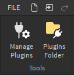
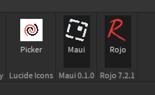
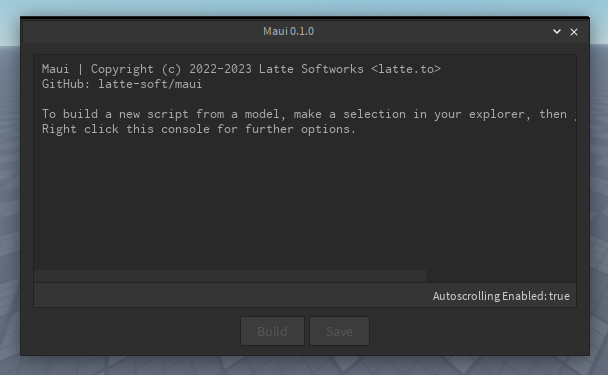
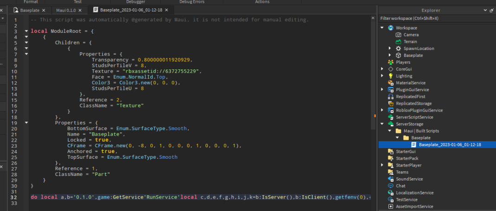
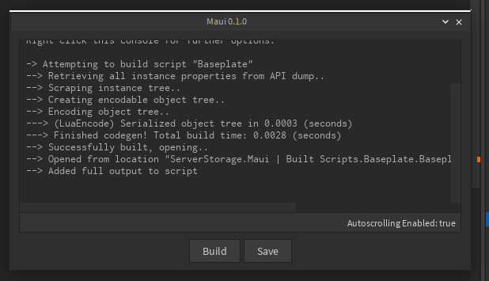
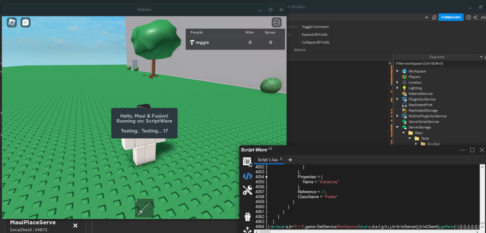

<div align="center">
    <!-- Logo -->
    <a href="https://github.com/latte-soft/maui#gh-dark-mode-only">
        
    </a>
    <a href="https://github.com/latte-soft/maui#gh-light-mode-only">
        
    </a>
    <!-- Title/Desc -->
    <h1>Maui</h1>
    <p>Roblox Studio Plugin for Packing Modules as Executable Luau Scripts</p>
    <p>
        <!-- Direct links -->
        <!-- Roblox marketplace -->
        <a href="https://www.roblox.com/library/12071720464">
            
        </a>
        <!-- GitHub releases -->
        <a href="https://github.com/latte-soft/maui/releases">
            
        </a>
        <!-- Latte Discord -->
        <a href="https://latte.to/discord">
            
        </a>
        <!-- Latte Twitter -->
        <a href="https://twitter.com/lattesoftworks">
            
        </a>
    </p>
    <p>
        <!-- PROJECT INFO START -->
        <!-- Repo stars -->
        <a href="https://github.com/latte-soft/maui/stargazers">
            
        </a>
        <!-- Repo forks -->
        <a href="https://github.com/latte-soft/maui/fork">
            
        </a>
        <!-- Latest release -->
        <a href="https://github.com/latte-soft/maui/releases/latest">
            
        </a>
        <!-- License info -->
        <a href="https://github.com/latte-soft/maui/blob/master/LICENSE.txt">
            
        </a>
        <!-- Last modified (latest commit) -->
        <a href="https://github.com/latte-soft/maui/commits">
            
        </a>
    </p>
</div>

___

## About

Put short, Maui is the full idea of Roblox model/object serialization **and** script packing put together. This allows script developers to use any of the tooling or libraries they wish! You could use a workflow with [VSCode](https://code.visualstudio.com), [Aftman](https://github.com/LPGhatguy/aftman), [Rojo](https://rojo.space), [Wally](https://wally.run), [Roblox-TS](https://roblox-ts.com), [Tarmac](https://github.com/Roblox/tarmac), [Darklua](https://darklua.com), etc.. Or just good ol' Roblox Studio! If it's built down to a Roblox model, you can build it into a script with Maui.

It's very general purpose, and will pack almost any model you throw at it. Any class, any property, any attribute, and *any* Lua DataType. As long as it's configured properly in the API dump and is a Lua-accessable DataType, it'll build!

Maui is built with [LuaEncode](https://github.com/regginator/LuaEncode), another general-purpose project of mine that was a direct component of this. It will handle **any** Lua/Roblox-Lua DataType, and even supports vanilla Lua 5.1! If it weren't for making LuaEncode, Maui wouldn't be possible.

### **Also..**

**The first thing you may be wondering if you clicked on the *"Get it on Roblox"* button before reading this** is probably something along the lines of **"Why is this a paid plugin?"**. Well, it *is* and it *isn't*. Let me explain.

The plugin, and **all** of its source code, will **always** be 100% free (as-in freedom) & open source, under the MIT License. You can download & build from source on the [GitHub repository](https://github.com/latte-soft/maui) (if you're worried about security or whatnot), or install a pre-built version directly from the [releases page](https://github.com/latte-soft/maui/releases). We *also* provide the plugin on Roblox's Developer Marketplace for ~250 Robux, if you want to support us, or just want automatic updates. With a self/pre-built version of the plugin, you're responsible for keeping it up-to-date in your plugins folder.

## Installation

* Installation via Roblox Marketplace

    You can purchase the plugin directly [here](https://www.roblox.com/library/12071720464). Remember, you *can* get the plugin for free directly from GitHub, but you are responsable for maintaining the build on your local machine.

    From there, just "Install" the plugin in Studio from Roblox like normal!

* Installation via GitHub Releases

    Goto the [latest release](https://github.com/latte-soft/maui/releases/lastest) on the GitHub repository, and download whichever file suites best. (`*.rbxm` is faster to load, and `*.rbxmx` is more readable.)

    If you don't know where your specific local-plugins folder is, in Studio, goto the "Plugins" tab via the ribbon-bar, and on the left there should be a "Plugins Folder" button, opening that will prompt the local plugins folder, where you will place the plugin in.

    

* Building from Source

    We provide a [`build.sh`](build.sh) script, however it will only work with a POSIX-compliant shell. You need everything in [`aftman.toml`](aftman.toml) installed, preferably with [Aftman](https://github.com/LPGhatguy/aftman).

    The following instructions are just for building Maui as quickly as possible, in-case you can't use `build.sh`.

  * Clone the Repository

    ```txt
    git clone https://github.com/latte-soft/maui.git && cd maui
    ```

  * Install Packages w/ Wally

    ```txt
    wally install
    ```

  * Build Model w/ Rojo

    ```txt
    rojo build -o Maui.rbxm
    ```

    And you're done! You can place the built model file into your plugins folder

## Usage

In a new/existing Studio place, go to the *"Plugins"* tab from the ribbon menu, and you'll see the plugin:





From there, just select an object, and click "Build"! Due to LuaEncode's fast speeds and optimization, Maui usually only takes a few *milliseconds* to create the output.

After the script is built, Maui should open the output script's editor window, and Maui will store information logs in it's internal console.





From there, you're done! You can run it in a script utility, another script, place it into obfuscation, etc.. It's 100% portable, and will work in almost *any* Roblox environment!

Remember, because it **literally** packs a Roblox model, you need to have at least 1 `LocalScript` (client context) or `Script` (server context) to actually initialize what you want. You *can* configure this to ignore context like `Script.Disabled` or running a script in the wrong context in the [project format](#the-maui-project-format). By default, if you provide a `MainModule`, Maui will return the value from it with the exact same behavior as requiring a module by ID on Roblox.

<sup>*This is a simple test-script for using Fusion with an exploit, you can see the source [here](tests/HelloFusion), and example output [here](examples/MauiFusionDemo_2023-01-06_13-24-23.lua)*</sup>



## The `maui` Script Global

In all Maui script closures, a "`maui`" global is pushed into the environment. You could use it in a script like so:

```lua
if maui then -- Then the script is running under Maui's environment!
    print(maui.Version)
end
```

Here's the *current* API reference:

* ### Get Version

  ```lua
  <string> maui.Version
  ```

  Returns a constant of the version of Maui the script was built with.

* ### Get Real Script Object

  ```lua
  <Instance: LuaSourceContainer> maui.Script
  ```

  Returns the REAL script global from the closure that's currently running.

* ### Get Shared Environment Table

  ```lua
  <table> maui.Shared
  ```

  Returns a "shared" table for ALL closures in a Maui-generated script, so you don't need to the real `_G` or `shared`.

## The "`.maui`" Project Format

##### *This is really meant for more advanced projects/modules you're packing, and right now there really isn't much outside of minification options.*

You can place a module named ".maui" under the model you're building, and Maui will expect the return to be a table of options. Here's a Lua template for this:

```lua
return {
    FormatVersion = 1, -- Isn't necessary in the project file, but just for future proofing the format incase we ever change anything

    -- All output options
    Output = {
        Directory = "return script.Parent", -- A string/function/instance (supports all) denoting/returning a specific output path in the DataModel, and a string of the filename
        ScriptName = "MauiGeneratedScript", -- The actual name of the output script object, e.g. "SomeScript"
        ScriptType = "LocalScript", -- Accepts "LocalScript", "Script", and "ModuleScript"

        MinifyTable = false, -- If the codegen table itself (made from LuaEncode) is to be minified
        UseMinifiedLoader = true -- Use the pre-minified LoadModule script in the codegen, which is always predefined and not useful for debugging
    },

    -- "Flags" to be respected at runtime
    Flags = {
        ContextualExecution = true, -- If client/server context should be checked at runtime, and ignores LuaSourceContainer.Disabled (e.g. LocalScripts only run on the client, Scripts only run on the server)
        ReturnMainModule = true -- **If applicable**, return the contents of a "MainModule"-named ModuleScript from the root of the model. This behaves exactly like Roblox's MainModule system
    },

    -- Property wl/bl overrides
    Properties = {
        Whitelist = {}, -- [ClassName] = {PropertyName, ...}
        Blacklist = {} --  ^^^
    }
}
```

You can *also* use [Rojo's JSON module feature](https://rojo.space/docs/v7/sync-details/#json-modules) (if you're using Rojo) to store this module in JSON, which would obviously be a file named ".maui.json":

```json
{
    "FormatVersion": 1,

    "Output": {
        "Directory": "return script.Parent",
        "ScriptName": "MauiGeneratedScript",
        "ScriptType": "LocalScript",

        "MinifyTable": false,
        "UseMinifiedLoader": true
    },

    "Flags": {
        "ContextualExecution": true,
        "ReturnMainModule": true
    },

    "Properties": {
        "Whitelist": {},
        "Blacklist": {}
    }
}
```

Still keep in mind, you need to include this file in your `*.project.json` file, if you're using Rojo.

## Contributing

*For now*, there really isn't any specific contribution instructions to follow. We're still working on our public Luau style-guide, so if you have an idea/implementation of something, show us your idea through an [issue](https://github.com/latte-soft/maui/issues) or [pull-request](https://github.com/latte-soft/maui/pulls)!

___

## License

This project, and all related files/documents, are licensed under the **MIT License**. You should have recieved a copy of [`LICENSE.txt`](LICENSE.txt) in this program. If not:

```txt
MIT License

Copyright (c) 2022-2023 Latte Softworks <latte.to>

Permission is hereby granted, free of charge, to any person obtaining a copy
of this software and associated documentation files (the "Software"), to deal
in the Software without restriction, including without limitation the rights
to use, copy, modify, merge, publish, distribute, sublicense, and/or sell
copies of the Software, and to permit persons to whom the Software is
furnished to do so, subject to the following conditions:

The above copyright notice and this permission notice shall be included in all
copies or substantial portions of the Software.

THE SOFTWARE IS PROVIDED "AS IS", WITHOUT WARRANTY OF ANY KIND, EXPRESS OR
IMPLIED, INCLUDING BUT NOT LIMITED TO THE WARRANTIES OF MERCHANTABILITY,
FITNESS FOR A PARTICULAR PURPOSE AND NONINFRINGEMENT. IN NO EVENT SHALL THE
AUTHORS OR COPYRIGHT HOLDERS BE LIABLE FOR ANY CLAIM, DAMAGES OR OTHER
LIABILITY, WHETHER IN AN ACTION OF CONTRACT, TORT OR OTHERWISE, ARISING FROM,
OUT OF OR IN CONNECTION WITH THE SOFTWARE OR THE USE OR OTHER DEALINGS IN THE
SOFTWARE.
```

*README social link icons by [@csqrl](https://github.com/csqrl)*
